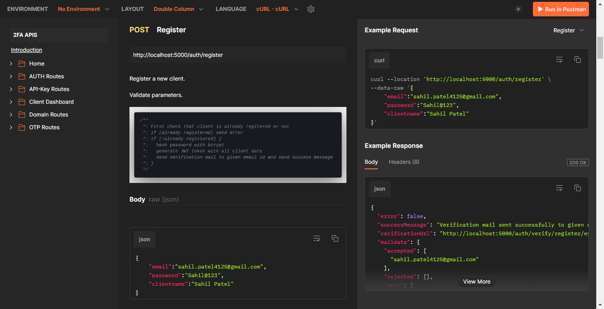

# For Detailed Documentation

### Click [here](https://documenter.getpostman.com/view/20548152/2sA35MxHxe)

## Screenshot of Documentation

# 2FA-Project Server Side APIs

- 2FA-Project is a fun project I developed during my undergraduation days.
- It's work on B2B model
- Our Clients are the developers that are looking for a good 2FA(2 Factor Authentication) service or looking for a OTP service to verify email ownership of its users
- Project is providing a solution by verifying the website domain name of client and then sending a OTP verification mail to their users on behalf of them
- We provide OTP verification panel for the users, after OTP verification user is redirected to the subroute of client's domain.

# NOTE
- This repo contains all the APIs used by frontend server of 2FA-Project.
- Nobody exept the frontend server is allowed use this APIs
- The documentation here is only for refernce of my work done for this project and how I implemented logic to design APIs

# Dependencies

    "axios": "^1.3.5",
    "bcrypt": "^5.1.0",
    "body-parser": "^1.20.2",
    "cookie-parser": "^1.4.6",
    "cors": "^2.8.5",
    "dotenv": "^16.0.3",
    "express": "^4.18.2",
    "jsonwebtoken": "^9.0.0",
    "moment": "^2.29.4",
    "mongoose": "^7.0.1",
    "nodemailer": "^6.9.1",
    "uuid": "^9.0.0",
    "validator": "^13.9.0"
    "nodemon": "^2.0.21"

